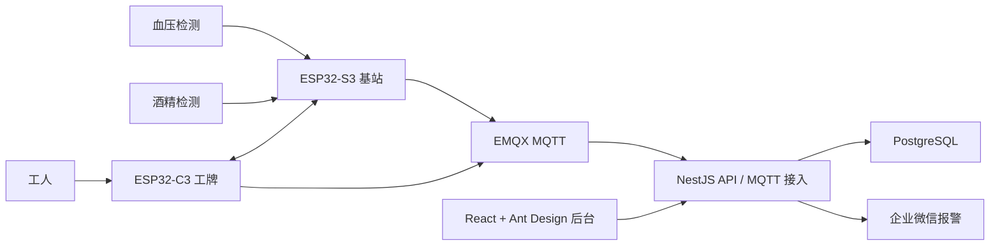

# AI兔帮守岗 SafePost

物流工作者上岗准入与安全监护系统。

SafePost 由智能安全工牌、现场基站、EMQX MQTT、NestJS API、PostgreSQL 和 React 管理后台组成，用于覆盖车厢装卸等传统监控盲区中的上岗检测、状态确认、主动报警、失联监测和主管处置闭环。

## 总体架构



## 目录结构

```text
.
├── docs
│   ├── PRD.md
│   ├── BP.md
│   ├── ProjectCharter.md
│   ├── HardwareSpec.md
│   ├── AccidentOrigin.md
│   ├── Architecture.md
│   ├── ProductArchitecture.md
│   ├── SystemArchitecture.md
│   ├── DatabaseDesign.md
│   ├── API.md
│   ├── MQTT.md
│   ├── BadgeIndustrialDesign.md
│   ├── HomepageCopy.md
│   ├── LandingPageCopy.md
│   ├── InvestorPitch.md
│   └── MVPRoadmap.md
├── server
│   ├── mqtt-server
│   │   ├── docker-compose.yml
│   │   └── README.md
│   └── api-server
│       ├── src
│       ├── package.json
│       └── tsconfig.json
├── web
│   └── dashboard
│       ├── src
│       ├── package.json
│       └── vite.config.ts
└── firmware
    ├── badge
    │   └── badge.ino
    └── station
        └── station.ino
```

## 模块说明

- `docs`：产品需求、15 页商业计划、项目立项书、架构图、硬件规格、工业设计、官网文案、路演内容、MVP 路线图、数据库、API 和 MQTT 协议。
- `server/api-server`：NestJS API 服务，包含工人、工牌、检测、报警、广播和企业微信通知模块。
- `server/mqtt-server`：EMQX 本地部署配置和 MQTT 说明。
- `web/dashboard`：React + Vite + Ant Design 主管后台。
- `firmware/badge`：ESP32-C3 工牌端示例代码。
- `firmware/station`：ESP32-S3 基站端示例代码。

## 本地启动顺序

1. 启动 EMQX：`cd server/mqtt-server && docker compose up -d`
2. 准备 PostgreSQL 并执行 `docs/DatabaseDesign.md` 中的 SQL。
3. 启动 API：`cd server/api-server && npm install && npm run start:dev`
4. 启动后台：`cd web/dashboard && npm install && npm run dev`
