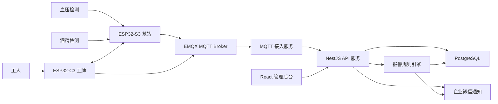

# 系统架构

## 1. 总体架构图

## 2. 数据流

1. 检测设备或基站上传血压、酒精检测结果。
2. API 服务写入检测记录并生成准入状态。
3. API 通过 MQTT 下发工牌状态。
4. 工牌周期上报心跳、按键、响应、电量。
5. MQTT 接入服务把设备消息转成业务事件。
6. 报警规则引擎判断 SOS、失联、无响应、超时等异常。
7. 报警入库并通过企业微信通知主管。
8. 管理后台查询实时状态、检测记录、报警日志。

## 3. 服务边界

| 服务 | 目录 | 职责 |
| --- | --- | --- |
| api-server | server/api-server | REST API、业务规则、数据库、企业微信 |
| mqtt-server | server/mqtt-server | EMQX 配置和 MQTT Topic 约定 |
| dashboard | web/dashboard | 主管后台 |
| badge firmware | firmware/badge | 工牌端示例 |
| station firmware | firmware/station | 基站端示例 |

## 4. 部署建议

- EMQX、API、PostgreSQL 部署在同一 VPC。
- API 水平扩展，报警规则使用数据库锁或消息队列避免重复触发。
- MQTT 使用独立设备账号；后台 API 使用 JWT。
- 企业微信通知失败时写入重试队列。
