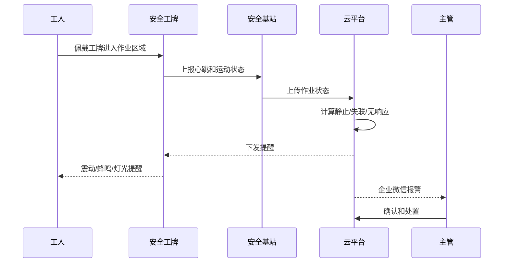

# 产品架构图

## 1. 产品模块图

```mermaid
flowchart TB
  SafePost["守岗 SafePost"]

  SafePost --> Badge["安全工牌"]
  SafePost --> CheckStation["上岗检测站"]
  SafePost --> BaseStation["安全基站"]
  SafePost --> Cloud["云平台"]
  SafePost --> Dashboard["主管后台"]
  SafePost --> WeCom["企业微信通知"]

  Badge --> BadgeId["唯一 ID / 人员绑定"]
  Badge --> Sos["SOS 主动报警"]
  Badge --> Motion["静止 / 无响应检测"]
  Badge --> Timer["作业计时 / 喝水提醒"]
  Badge --> Light["绿黄红状态灯"]
  Badge --> Haptic["震动 / 蜂鸣提醒"]

  CheckStation --> Identity["身份确认"]
  CheckStation --> BloodPressure["血压检测"]
  CheckStation --> Alcohol["酒精检测"]
  CheckStation --> Access["准入判定"]

  BaseStation --> Area["作业区域管理"]
  BaseStation --> Relay["工牌通信中继"]
  BaseStation --> Broadcast["广播通知"]
  BaseStation --> Upload["数据上传"]

  Cloud --> People["人员档案"]
  Cloud --> Devices["设备管理"]
  Cloud --> Rules["报警规则"]
  Cloud --> Logs["检测 / 作业 / 报警日志"]
  Cloud --> Analytics["风险分析"]

  Dashboard --> Realtime["实时看板"]
  Dashboard --> Alerts["报警处置"]
  Dashboard --> Records["记录追溯"]
```

## 2. 产品闭环

```mermaid
sequenceDiagram
  participant Worker as 工人
  participant Badge as 安全工牌
  participant Station as 安全基站
  participant Cloud as 云平台
  participant Manager as 主管

  Worker->>Badge: 佩戴工牌进入作业区域
  Badge->>Station: 上报心跳和运动状态
  Station->>Cloud: 上传作业状态
  Cloud->>Cloud: 计算静止/失联/无响应
  Cloud-->>Badge: 下发提醒
  Badge-->>Worker: 震动/蜂鸣/灯光提醒
  Cloud-->>Manager: 企业微信报警
  Manager->>Cloud: 确认和处置
```

## 3. 第一版产品边界

第一版专注验证“异常发现和报警确认”闭环，不追求完整健康监测。

保留：

- 工牌 ID。
- SOS。
- 静止。
- 无响应。
- 作业计时。
- 喝水提醒。
- 企业微信报警。

排除：

- AI。
- GPS。
- 摄像头。
- 心率。
- 血氧。
