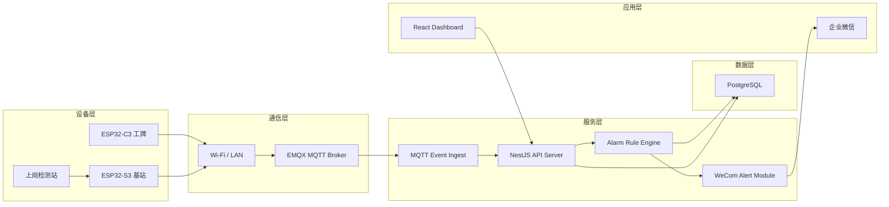
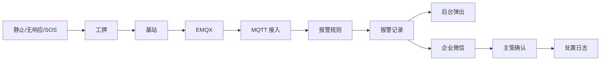

# 系统架构图

## 1. 技术架构

## 2. 报警链路

## 3. 数据对象

| 对象 | 说明 |
| --- | --- |
| Worker | 工人档案 |
| Badge | 工牌设备 |
| Station | 安全基站 |
| CheckRecord | 血压/酒精检测记录 |
| WorkSession | 作业会话 |
| DeviceEvent | 工牌/基站事件 |
| Alert | 报警记录 |
| NotificationLog | 通知记录 |

## 4. 部署建议

- EMQX、API、PostgreSQL 部署在同一内网或云 VPC。
- 基站通过站点网络连接 MQTT。
- 工牌优先连接基站，必要时可直接 MQTT。
- 企业微信通知作为第一版报警出口。
- 后续可增加短信、电话、声光报警器和皮带机联动。
